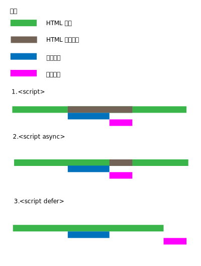

**目录：**

- [2. HTML 中的 JavaScript](#2-html-中的-javascript)
  - [2.1. `<script>` 元素](#21-script-元素)
    - [2.1.1. 标签位置](#211-标签位置)
    - [2.1.2. 推迟执行脚本](#212-推迟执行脚本)
    - [2.1.3. 异步执行脚本](#213-异步执行脚本)
    - [2.1.4. 动态加载脚本](#214-动态加载脚本)
  - [2.2. 行内代码与外部文件](#22-行内代码与外部文件)
  - [2.3. 文档模式](#23-文档模式)
  - [2.4. `<noscript>` 元素](#24-noscript-元素)

# 2. HTML 中的 JavaScript

本章内容:

- 使用`<script>`元素
- 行内脚本与外部脚本的比较
- 文档模式对 JavaScript 有什么影响
- 确保 JavaScript 不可用时的用户体验

将 JavaScript 引入网页，首先要解决它与网页的主导语言 HTML 的关系问题。在 JavaScript 早期，网景公司的工作人员希望在将 JavaScript 引入 HTML 页面的同时，不会导致页面在其他浏览器中渲染出问题。通过反复试错和讨论，他们最终做出了一些决定，并达成了向网页中引入通用脚本能力的共识。当初他们的很多工作得到了保留，并且最终形成了 HTML 规范。

## 2.1. `<script>` 元素

将 JavaScript 插入 HTML 的主要方法是使用 `<script>` 元素。这个元素是由网景公司创造出来，并最早在 Netscape Navigator 2 中实现的。后来，这个元素被正式加入到 HTML 规范。`<script>` 元素有下列 8 个属性：

- async：可选。表示应该立即开始下载脚本，但不能阻止其他页面动作，比如下载资源或等待其他脚本加载。只对外部脚本文件有效。
- charset：可选。使用 src 属性指定的代码字符集。这个属性很少使用，因为大多数浏览器不在乎它的值。
- crossorigin：可选。配置相关请求的 CORS（跨源资源共享）设置。默认不使用 CORS。crossorigin= "anonymous" 配置文件请求不必设置凭据标志。crossorigin="use-credentials"设置凭据标志，意味着出站请求会包含凭据。
- defer：可选。表示脚本可以延迟到文档完全被解析和显示之后再执行。只对外部脚本文件有效。在 IE7 及更早的版本中，对行内脚本也可以指定这个属性。
- integrity：可选。允许比对接收到的资源和指定的加密签名以验证子资源完整性（SRI， Subresource Integrity）。如果接收到的资源的签名与这个属性指定的签名不匹配，则页面会报错，脚本不会执行。这个属性可以用于确保内容分发网络（CDN，Content Delivery Network）不会提供恶意内容。
- language：废弃。最初用于表示代码块中的脚本语言（如"JavaScript"、"JavaScript 1.2"或"VBScript"）。大多数浏览器都会忽略这个属性，不应该再使用它。
- src：可选。表示包含要执行的代码的外部文件。
- type：可选。代替 language，表示代码块中脚本语言的内容类型（也称 MIME 类型）。按照惯例，这个值始终都是"text/javascript"，尽管"text/javascript"和"text/ecmascript" 都已经废弃了。JavaScript 文件的 MIME 类型通常是"application/x-javascript"，不过给 type 属性这个值有可能导致脚本被忽略。在非 IE 的浏览器中有效的其他值还有"application/javascript"和"application/ecmascript"。如果这个值是 module，则代码会被当成 ES6 模块，而且只有这时候代码中才能出现 import 和 export 关键字。

使用 `<script>` 的方式有两种：通过它直接在网页中嵌入 JavaScript 代码，以及通过它在网页中包含外部 JavaScript 文件。

要嵌入行内 JavaScript 代码，直接把代码放在`<script>`元素中就行：

```html
<script>
  function sayHi() {
    console.log("Hi!");
  }
</script>
```

包含在`<script>`内的代码会被从上到下解释。在上面的例子中，被解释的是一个函数定义，并且该函数会被保存在解释器环境中。在`<script>`元素中的代码被计算完成之前，页面的其余内容不会被加载，也不会被显示。

在使用行内 JavaScript 代码时，要注意代码中不能出现字符串`</script>`。比如，下面的代码会导致浏览器报错：

```html
<script>
  function sayScript() {
    console.log("</script>");
  }
</script>
```

浏览器解析行内脚本的方式决定了它在看到字符串`</script>`时，会将其当成结束的`</script>`标签。想避免这个问题，只需要转义字符“\”即可：

```html
<script>
  function sayScript() {
    console.log("<\/script>");
  }
</script>
```

这样修改之后，代码就可以被浏览器完全解释，不会导致任何错误。

要包含外部文件中的 JavaScript，就必须使用 src 属性。这个属性的值是一个 URL，指向包含 JavaScript 代码的文件，比如：

```html
<script src="example.js"></script>
```

这个例子在页面中加载了一个名为 example.js 的外部文件。文件本身只需包含要放在`<script>`的起始及结束标签中间的 JavaScript 代码。与解释行内 JavaScript 一样，在解释外部 JavaScript 文件时，页面也会阻塞。（阻塞时间也包含下载文件的时间。）在 XHTML 文档中，可以忽略结束标签，比如：

```html
<script src="example.js" />
```

以上语法不能在 HTML 文件中使用，因为它是无效的 HTML，有些浏览器不能正常处理，比如 IE。

另外，使用了 src 属性的`<script>`元素不应该再在`<script`>和`</script>`标签中再包含其他 JavaScript 代码。如果两者都提供的话，则浏览器只会下载并执行脚本文件，从而忽略行内代码。

`<script>`元素的一个最为强大、同时也备受争议的特性是，它可以包含来自外部域的 JavaScript 文件。跟``元素很像，`<script>`元素的 src 属性可以是一个完整的 URL，而且这个 URL 指向的资源可以跟包含它的 HTML 页面不在同一个域中，比如这个例子：

```html
<script src="http://www.somewhere.com/afile.js"></script>
```

浏览器在解析这个资源时，会向 src 属性指定的路径发送一个 GET 请求，以取得相应资源，假定是一个 JavaScript 文件。这个初始的请求不受浏览器同源策略限制，但返回并被执行的 JavaScript 则受限制。当然，这个请求仍然受父页面 HTTP/HTTPS 协议的限制。

来自外部域的代码会被当成加载它的页面的一部分来加载和解释。这个能力可以让我们通过不同的域分发 JavaScript。不过，引用了放在别人服务器上的 JavaScript 文件时要格外小心，因为恶意的程序员随时可能替换这个文件。在包含外部域的 JavaScript 文件时，要确保该域是自己所有的，或者该域是一个可信的来源。`<script>`标签的 integrity 属性是防范这种问题的一个武器，但这个属性也不是所有浏览器都支持。

不管包含的是什么代码，浏览器都会按照`<script>`在页面中出现的顺序依次解释它们，前提是它们没有使用 defer 和 async 属性。第二个`<script>`元素的代码必须在第一个`<script>`元素的代码解释完毕才能开始解释，第三个则必须等第二个解释完，以此类推。

### 2.1.1. 标签位置

过去，所有`<script>`元素都被放在页面的`<head>`标签内，如下面的例子所示：

```html
<!DOCTYPE html>
<html>
  <head>
    <title>Example HTML Page</title>
    <script src="example1.js"></script>
    <script src="example2.js"></script>
  </head>
  <body>
    <!-- 这里是页面内容 -->
  </body>
</html>
```

这种做法的主要目的是把外部的 CSS 和 JavaScript 文件都集中放到一起。不过，把所有 JavaScript 文件都放在`<head>`里，也就意味着必须把所有 JavaScript 代码都下载、解析和解释完成后，才能开始渲染页面（页面在浏览器解析到`<body>`的起始标签时开始渲染）。对于需要很多 JavaScript 的页面，这会导致页面渲染的明显延迟，在此期间浏览器窗口完全空白。为解决这个问题，现代 Web 应用程序通常将所有 JavaScript 引用放在`<body>`元素中的页面内容后面，如下面的例子所示：

```html
<!DOCTYPE html>
<html>
  <head>
    <title>Example HTML Page</title>
  </head>
  <body>
    <!-- 这里是页面内容 -->
    <script src="example1.js"></script>
    <script src="example2.js"></script>
  </body>
</html>
```

这样一来，页面会在处理 JavaScript 代码之前完全渲染页面。用户会感觉页面加载更快了，因为浏览器显示空白页面的时间短了。

### 2.1.2. 推迟执行脚本

HTML 4.01 为`<script>`元素定义了一个叫 defer 的属性。当浏览器解析到带有 defer 属性的脚本时，浏览器会并行地下载该脚本，并行的意思是它不会像正常脚本那样在下载时阻塞后面的 HTML 解析，当整个 HTML 文件解析完毕时，带有 defer 属性的脚本才会按照他们出现的顺序执行。

```html
<!DOCTYPE html>
<html>
  <head>
    <title>Example HTML Page</title>
    <script defer src="example1.js"></script>
    <script defer src="example2.js"></script>
  </head>
  <body>
    <!-- 这里是页面内容 -->
  </body>
</html>
```

虽然这个例子中的`<script>`元素包含在页面的`<head>`中，但它们会在浏览器解析到结束的`</html>`标签后才会执行。HTML5 规范要求脚本应该按照它们出现的顺序执行，因此第一个推迟的脚本会在第二个推迟的脚本之前执行，而且两者都会在 DOMContentLoaded 事件之前执行（关于事件，请参考第 17 章）。不过在实际当中，推迟执行的脚本不一定总会按顺序执行或者在 DOMContentLoaded 事件之前执行，因此最好只包含一个这样的脚本。

如前所述，defer 属性只对外部脚本文件才有效。这是 HTML5 中明确规定的，因此支持 HTML5 的浏览器会忽略行内脚本的 defer 属性。IE4~7 展示出的都是旧的行为，IE8 及更高版本则支持 HTML5 定义的行为。

对 defer 属性的支持是从 IE4、Firefox 3.5、Safari 5 和 Chrome 7 开始的。其他所有浏览器则会忽略这个属性，按照通常的做法来处理脚本。考虑到这一点，还是把要推迟执行的脚本放在页面底部比较好。

### 2.1.3. 异步执行脚本

HTML5 为`<script>`元素定义了 async 属性。当浏览器解析到带有 async 属性的脚本时，浏览器会并行地下载该脚本，并行的意思是它不会像正常脚本那样在下载时阻塞后面的 HTML 解析，当该脚本下载完毕时，该脚本会被立即执行，这和 defer 不同，脚本执行时会阻塞后面的 HTML 解析。

```html
<!DOCTYPE html>
<html>
  <head>
    <title>Example HTML Page</title>
    <script async src="example1.js"></script>
    <script async src="example2.js"></script>
  </head>
  <body>
    <!-- 这里是页面内容 -->
  </body>
</html>
```

当出现另一个 async 脚本时，同样的，浏览器会并行地下载它，但是由于不能准确地知道哪个脚本先下载完毕，所以多个异步脚本可能不会以他们出现的顺序执行。

异步脚本保证会在页面的 load 事件前执行，但可能会在 DOMContentLoaded（参见第 17 章）之前或之后。Firefox 3.6、Safari 5 和 Chrome 7 支持异步脚本。使用 async 也会告诉页面你不会使用 document.write，不过好的 Web 开发实践根本就不推荐使用这个方法。

下图总结了普通脚本，异步脚本和延迟脚本的特点：



### 2.1.4. 动态加载脚本

除了`<script>`标签，还有其他方式可以加载脚本。因为 JavaScript 可以使用 DOM API，所以通过向 DOM 中动态添加 script 元素同样可以加载指定的脚本。只要创建一个 script 元素并将其添加到 DOM 即可。

```js
let script = document.createElement("script");
script.src = "gibberish.js";
document.head.appendChild(script);
```

当然，在把 HTML 元素添加到 DOM 且执行到这段代码之前不会发送请求。默认情况下，以这种方式创建的`<script>`元素是以异步方式加载的，相当于添加了 async 属性。不过这样做可能会有问题，因为所有浏览器都支持 createElement()方法，但不是所有浏览器都支持 async 属性。因此，如果要统一动态脚本的加载行为，可以明确将其设置为同步加载：

```js
let script = document.createElement("script");
script.src = "gibberish.js";
script.async = false;
document.head.appendChild(script);
```

以这种方式获取的资源对浏览器预加载器是不可见的。这会严重影响它们在资源获取队列中的优先级。根据应用程序的工作方式以及怎么使用，这种方式可能会严重影响性能。要想让预加载器知道这些动态请求文件的存在，可以在文档头部显式声明它们：

```html
<link rel="preload" href="gibberish.js" />
```

## 2.2. 行内代码与外部文件

虽然可以直接在 HTML 文件中嵌入 JavaScript 代码，但通常认为最佳实践是尽可能将 JavaScript 代码放在外部文件中。不过这个最佳实践并不是明确的强制性规则。推荐使用外部文件的理由如下。

- **可维护性**。JavaScript 代码如果分散到很多 HTML 页面，会导致维护困难。而用一个目录保存所有 JavaScript 文件，则更容易维护，这样开发者就可以独立于使用它们的 HTML 页面来编辑代码。
- **缓存**。浏览器会根据特定的设置缓存所有外部链接的 JavaScript 文件，这意味着如果两个页面都用到同一个文件，则该文件只需下载一次。这最终意味着页面加载更快。
- **适应未来**。通过把 JavaScript 放到外部文件中，就不必考虑用 XHTML 或前面提到的注释黑科技。包含外部 JavaScript 文件的语法在 HTML 和 XHTML 中是一样的。

在配置浏览器请求外部文件时，要重点考虑的一点是它们会占用多少带宽。在 SPDY/HTTP2 中，预请求的消耗已显著降低，以轻量、独立 JavaScript 组件形式向客户端送达脚本更具优势。

比如，第一个页面包含如下脚本：

```html
<script src="mainA.js"></script>
<script src="component1.js"></script>
<script src="component2.js"></script>
<script src="component3.js"></script>
...
```

后续页面可能包含如下脚本：

```html
<script src="mainB.js"></script>
<script src="component3.js"></script>
<script src="component4.js"></script>
<script src="component5.js"></script>
...
```

在初次请求时，如果浏览器支持 SPDY/HTTP2，就可以从同一个地方取得一批文件，并将它们逐个放到浏览器缓存中。从浏览器角度看，通过 SPDY/HTTP2 获取所有这些独立的资源与获取一个大 JavaScript 文件的延迟差不多。

在第二个页面请求时，由于你已经把应用程序切割成了轻量可缓存的文件，第二个页面也依赖的某些组件此时已经存在于浏览器缓存中了。

当然，这里假设浏览器支持 SPDY/HTTP2，只有比较新的浏览器才满足。如果你还想支持那些比较老的浏览器，可能还是用一个大文件更合适。

## 2.3. 文档模式

IE5.5 发明了文档模式的概念，即可以使用 doctype 切换文档模式。最初的文档模式有两种：**混杂模式(quirks mode)** 和 **标准模式(standards mode)**。前者让 IE 像 IE5 一样（支持一些非标准的特性），后者让 IE 具有兼容标准的行为。虽然这两种模式的主要区别只体现在通过 CSS 渲染的内容方面，但对 JavaScript 也有一些关联影响，或称为副作用。本书会经常提到这些副作用。

IE 初次支持文档模式切换以后，其他浏览器也跟着实现了。随着浏览器的普遍实现，又出现了第三种文档模式：**准标准模式(almost standards mode)**。这种模式下的浏览器支持很多标准的特性，但是没有标准规定得那么严格。主要区别在于如何对待图片元素周围的空白（在表格中使用图片时最明显）。

混杂模式在所有浏览器中都以省略文档开头的 doctype 声明作为开关。这种约定并不合理，因为混杂模式在不同浏览器中的差异非常大，不使用黑科技基本上就没有浏览器一致性可言。

标准模式通过下列几种文档类型声明开启：

```html
<!-- HTML 4.01 Strict -->
<!DOCTYPE html PUBLIC "-//W3C//DTD HTML 4.01//EN" "http://www.w3.org/TR/html4/strict.dtd">
<!-- XHTML 1.0 Strict -->
<!DOCTYPE html PUBLIC "-//W3C//DTD XHTML 1.0 Strict//EN" "http://www.w3.org/TR/xhtml1/DTD/xhtml1-strict.dtd">
<!-- HTML5 -->
<!DOCTYPE html>
```

准标准模式通过过渡性文档类型（Transitional）和框架集文档类型（Frameset）来触发：

```html
<!-- HTML 4.01 Transitional -->
<!DOCTYPE html PUBLIC "-//W3C//DTD HTML 4.01 Transitional//EN" "http://www.w3.org/TR/html4/loose.dtd">
<!-- HTML 4.01 Frameset -->
<!DOCTYPE html PUBLIC "-//W3C//DTD HTML 4.01 Frameset//EN" "http://www.w3.org/TR/html4/frameset.dtd">
<!-- XHTML 1.0 Transitional -->
<!DOCTYPE html PUBLIC "-//W3C//DTD XHTML 1.0 Transitional//EN" "http://www.w3.org/TR/xhtml1/DTD/xhtml1-transitional.dtd">
<!-- XHTML 1.0 Frameset -->
<!DOCTYPE html PUBLIC "-//W3C//DTD XHTML 1.0 Frameset//EN" "http://www.w3.org/TR/xhtml1/DTD/xhtml1-frameset.dtd">
```

准标准模式与标准模式非常接近，很少需要区分。人们在说到“标准模式”时，可能指其中任何一个。而对文档模式的检测（本书后面会讨论）也不会区分它们。本书后面所说的标准模式，指的就是除混杂模式以外的模式。

## 2.4. `<noscript>` 元素

针对早期浏览器不支持 JavaScript 的问题，需要一个页面优雅降级的处理方案。最终，`<noscript>`元素出现，被用于给不支持 JavaScript 的浏览器提供替代内容。虽然如今的浏览器已经 100%支持 JavaScript，但对于禁用 JavaScript 的浏览器来说，这个元素仍然有它的用处。

`<noscript>`元素可以包含任何可以出现在`<body>`中的 HTML 元素，`<script>`除外。在下列两种情况下，浏览器将显示包含在`<noscript>`中的内容：

- 浏览器不支持脚本；
- 浏览器对脚本的支持被关闭。

任何一个条件被满足，包含在`<noscript>`中的内容就会被渲染。否则，浏览器不会渲染`<noscript>`中的内容。

下面是一个例子：

```html
<!DOCTYPE html>
<html>
  <head>
    <title>Example HTML Page</title>
    <script defer="defer" src="example1.js"></script>
    <script defer="defer" src="example2.js"></script>
  </head>
  <body>
    <noscript>
      <p>This page requires a JavaScript-enabled browser.</p>
    </noscript>
  </body>
</html>
```
